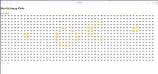

# Mostly happy cells
Simple game of life variation I implented to learn more about React/Typescript





These cellular automata rules:

 - Any dead cell with exactly turehree sad neighbors becomes a sad cell.    
 - Any dead cell with exactly two sad neighbors and 1 happy neighbor becomes a sad cell.    
 - Any dead cell with exactly one sad neighbor and 2 happy neighbors becomes a happy cell.
 - Any dead cell with exactly 3 happy neighbors becomes a happy cell.
 - Any sad or happy cell with a combined total of exactly two or three sad or happy neighbours survives.
    
Look at [src/engine.test.ts](https://github.com/rilopez/mostly-happy-cells/blob/master/src/engine.test.ts#L4)  for test code 
asserting those rules.


## Usage 

This project was bootstrapped with [Create React App](https://github.com/facebook/create-react-app). 
so to start  the app in the development mode. run 

```bash 
yarn start
```

Open [http://localhost:3000](http://localhost:3000) to view it in the browser.

The page will reload if you make edits. You will also see any lint errors in the console.
